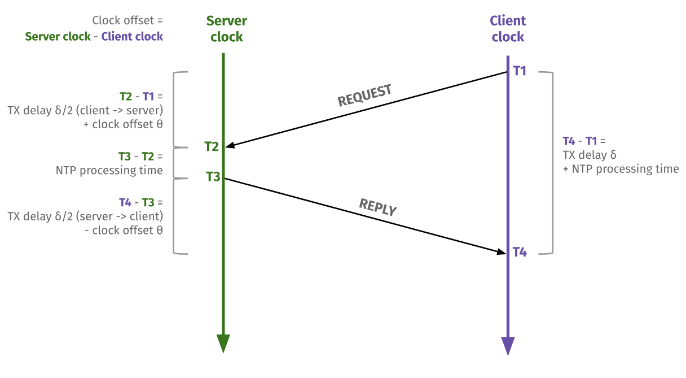

# Sync

This describes our new design for clock syncing between cameras and RoboRio.

## Original design

As originally [designed](https://github.com/wpilibsuite/allwpilib/blob/main/ntcore/doc/networktables4.adoc), the Network Tables system included
periodic timestamp synchronization using an implementation of [Cristian's_algorithm]( https://en.wikipedia.org/wiki/Cristian%27s_algorithm),
an idea so simple that it's hard to believe it has a name:

1. The client sends the current client time, $org$.
2. The server notes the time at receipt, $rec$.
3. The server sends $rec$ and $org$ to the client. 
4. The client notes the time at receipt, $dst$
5. The difference is the round-trip-time (RTT):

```math
RTT = 2 * delay = dst - org
```

6. The client can surmise that $rec$ happened exactly between $org$ and $dst$.
7. In Network Tables the offset is added to the localtime to obtain the server time:

```math
rec = dst - delay + offset
```

or

```math
offset = rec + delay - dst 
```

This offset was used to compute the server time for each data frame, which appears in the `timestamp` field.

```math
timestamp = clienttime + offset
```

## Revision

Immediately after release, this design caused [trouble](https://github.com/wpilibsuite/allwpilib/issues/5224), and it was [changed](https://github.com/wpilibsuite/allwpilib/commit/8b7c6852cf70d0cb9168014b68508bae77ed3fc8) from a periodic estimate to a one-shot estimate done [once at connection time](https://github.com/wpilibsuite/allwpilib/commit/8b7c6852cf70d0cb9168014b68508bae77ed3fc8#diff-2375aa79a1c18a37a91f82a9015410f427d1001400b94522fda5b4889b615493R700).  The reason given was that the variability of the measured round-trip time was sometimes high, and since the round-trip-time is simply added to the offset, and because each new packet produced a new offset, with no filtering of any kind, there was sometimes high variability in the offset.  This led to symptoms such as producing timestamps for the future.

## Problem

The main problem with the solution above is that it reduces the scope of the solution
from general clock synchronization to a single offset snapshot.  In reality, clocks
are not simply offset from each other -- they also go different speeds, resulting
in clock drift.

Because we use the Network Tables timestamp offset mechanism in the pipeline for vision,
the clock drift has been a problem.  We haven't understood it as such until now
(Feb 2026) -- in the past we attempted to simply "add magic numbers" to correct
what seemed like "extra delay".  These magic numbers have been "hard to tune"
because, of course, the correct "extra delay" depends on how long the robot has
been turned on!  It's not constant "extra delay" at all, it's
continuous drift.

Another problem with the implementation above is that it assumes the turnaround
time at the server is zero.

## Solution

IMHO the main problem with the initial design is not periodicity, it's that each
update mixed two very different quantities, and applied them as completely
authoritative.  The RTT measurement is short (milliseconds) and noisy,
varying in normal operation by a millisecond, and in abnormal operation
by tens of milliseconds.  The offset is very long (a billion seconds), and it
is not noisy at all: it varies slowly, smoothly, and consistently.  The change
in offset might be 3 ms per minute -- on the same scale as the RTT noise, but
this change in offset is meaningful to the camera pipeline.

So the solution is to model the estimated quantities more realistically:

1. Model delay correctly (see below)
2. Avoid mixing the delay measurement with the offset
3. Model the offset as slowly-varying, so noisy updates don't affect it much.

### Delay

For user code in Network Tables, delay is made up of several components:

1. Sender delay.  The time between writing a message to the buffer and when it is actually sent, a uniform distribution,  $\mathcal{U}(0, 20 ms)$
2. Network latency.  The two hosts are connected via a level-2 switch, which adds minimal delay, say 50 microseconds.
3. Latency due to Ethernet retransmits.  The backoff algorithm will add random increments of 50 microseconds in case of collision.
4. Receiver delay.  The time between the message arriving and user code reading it, $\mathcal{U}(0, 20 ms)$

The main components of delay are the two uniform distributions.  If these
are independent, their sum is an [Irwin-Hall distribution](https://en.wikipedia.org/wiki/Irwin%E2%80%93Hall_distribution)
of two components, i.e. a [trianglular distribution](https://en.wikipedia.org/wiki/Triangular_distribution).
Since the components have width 20 ms, the triangle has width 40 ms: $\mathcal{T}(-20, 20, 0)$

Note that in our measurement scheme (below), the two delay components are **not** independent,
they are somewhat anticorrelated:

* the first delay includes the time between the message
arrival and the FPGA interrupt firing, and whatever code runs between the interrupt and
the message handler.
* the second delay includes the time between the message handler's completion and the outgoing
buffer flush in Network Tables, which is roughly aligned with the interrupt clock.

If these delays were perfectly anticorrelated then the resulting noise would be uniform,
$\mathcal{U}(-10, 10)$.

### Measurement

We'll collect timing information a little differently,
more like the way the [Network Time Protocol](https://en.wikipedia.org/wiki/Network_Time_Protocol) works:

1. client sends $org$
2. server records $org$ and the receipt time, $rec$ 
3. server sends $org$ and $rec$ back to the client, with the sending time, $xmt$
4. client records $org$, $rec$, $xmt$, and the receipt time, $dst$.

We can describe the packet timings:

```math
rec = org + offset + \mathcal{U}(0, 20)

\\[10pt]

dst = xmt - offset + \mathcal{U}(0, 20)
```

So we can take the difference.  The difference of two $\mathcal{U}$ distributions yields $\mathcal{T}$ with a mean of zero:

```math
rec - dst = org - xmt + 2 * offset + \mathcal{T}(-20, 20, 0)

```

or

```math
offset = \frac{1}{2}\left( rec + xmt - dst - org \right) + + \mathcal{T}(-10, 10, 0)
```

If $rec$ and $xmt$ are the same, this can be simplified:

```math
offset = rec - \frac{dst + org}{2} + \mathcal{T}(-10, 10, 0)
```
which is similar to the formulation used in Network Tables.

### Averaging

We can represent the offset as a simple average:

```math
offset(t+1) = (1-\lambda) * offset(t) + \lambda * measurement
```

So what should we choose for $\lambda$?

The steady-state error width is simply the measurement error times $\lambda$, so
if lambda is 0.1, then the steady state error is around 1 ms.

At full speed (5.0 m/s) a 1 ms error translates to a 5 mm position error, which is
acceptable.

How long does it take to converge?  If the initial offset estimate is very wrong,
say, zero, and the correct estimate is something like 2e9, then it will take
around 5 seconds to converge, which is acceptable.

[This spreadsheet](https://docs.google.com/spreadsheets/d/1Cf3FyOcmEGIvTdcXcVz9Y91zu_R-jeFPBn1eEaiUlrk/edit?gid=0#gid=0) shows these examples.

A better estimate doesn't change the convergence time very much, since the
offset is so much larger than the noise.  We could choose a larger $\lambda$ if the
measurement is *far* from the previous estimate.

### Messages

We'll use the NTP terminology.

These "messages" could be
* Network Tables updates, read
using `NetworkTableListenerPoller.readQueue()`
* UDP datagrams, more like actual NTP packets (but not exactly).  For these, we could revive the "log" code from 2024.



Each NTP packet is the same, with four time fields.  Each timestamp is 64-bit integer microseconds.

* T1, Origin ($org$): Time at the client when the request departed for the server.
* T2, Receive ($rec$): Time at the server when the request arrived from the client.
* T3, Transmit ($xmt$): Time at the server when the reply left for the client.
* T4, Destination ($dst$): Time at the client when the reply arrived from the server.

The "empty" fields are zero.

Sequence:

* The client (pi) sends a REQUEST containing the sending time, $org$.
* The server (rio) records the receipt time, $rec$.
* The server eventually sends a REPLY containing $org$, $rec$, and the sending time, $xmt$.
* The client (pi) receives the REPLY and records the arrival time, $dst$
* The client computes the offset, and updates its offset estimate using some filtering methods.

In Python:
```python
@dataclass
class SyncRequest():
    org: int

@dataclass
class SyncReply():
    org: int
    rec: int
    xmt: int
```

In Java:
```java
record SyncRequest(long org){}
record SyncReply(long org, long rec, long xmt){}
```

In Network Tables:
```
/vision/{IDENTITY}/syncrequest
/vision/{IDENTITY}/syncreply
```

### Code

First, the python code sends a request:

```python
pub = inst.getStructTopic("/vision/{IDENTITY}/syncrequest", SyncRequest).publish()    
pub.set(SyncRequest(ntcore._now()))
```

Then, the Java code receives the request, and sends a reply.  This code can
run in the normal 50 Hz loop.

```java
var sub = inst.getStructTopic<SyncRequest>(
    "/vision/{IDENTITY}/syncrequest", SyncRequest.struct).subscribe();
var pub = inst.getStructTopic<SyncReply>(
    "/vision/{IDENTITY}/syncreply", SyncReply.struct).publish();

// only pick up new values
TimestampedObject<SyncRequest>[] queue = sub.readQueue();
int n = queue.length;
if (n > 0) {
    var org = queue[n-1].value.org();
    var now = RobotController.getFPGATime();
    pub.set(new SyncReply(org, now, now));
}
```

And then the python receives the reply:

```python
sub = inst.getStructTopic("/vision/IDENTITY/syncreply", SyncReply).subscribe()
queue: list[TimestampedStruct] = sub.readQueue()
if queue:
    syncreply = queue[-1]
    now = ntcore._now()
    offset = offset(syncreply.org, syncreply.rec, syncreply.xmt, now)
```

compute the measurement:

```python
def offset(org: int, rec: int, xmt: int, dst: int) -> int:
    return (rec + xmt - dst - org) // 2
```

and then fuse the measurement with the average:

```python
def fuse(measurement: int) -> None:
    global estimate
    diff = estimate - measurement
    if abs(diff) > 1000000:
        # large change, step right to the measurement
        estimate = measurement
    else:
        # small change, average it
        estimate = (estimate * 99 + measurement) // 100
```

We could borrow other kinds of filtering from NTP, for example, if the
difference between the estimate and measurement is high, just use the measurement.

For outgoing telemetry, we can't use the Network Tables timestamps
at all, because the publisher end expects "local" time -- there's
no simple way the explicitly provide a "server" time.
So instead, we add timestamp fields to our structs.

Because the `Struct` serialization is intended for fixed-length encoding only
(i.e. no internal arrays), we'll repeat the timestamp in each message.

```java
public class Blip26 {
    private final long timestamp;    // server timestamp, microseconds
    private final int id;            // tag id
    private final Transform3d pose;  // camera-relative tag transform
```

```python
pub = inst.getStructArrayTopic(name, Blip26).publish()
blips = [
    Blip26(ntcore._now() + self._measurement, id, pose)
]
pub.set(blips)
```

## References

* NTP v4 [RFC 5905](https://datatracker.ietf.org/doc/html/rfc5905)